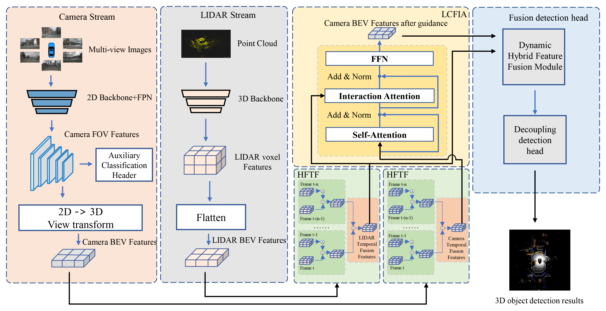

# BEV-CMHF: A Cross-Modality Hybrid Fusion Framework for BEV 3D Object Detection with Feature Interaction and Temporal Fusion
## Abstract
Autonomous driving technology has garnered significant attention for its potential to reduce driver burden and enhance road safety. Modern autonomous driving systems rely on a variety of sensors to perceive complex driving environments. Many existing methods map heterogeneous data into the bird’s eye view (BEV) space for feature fusion. However, they often fail to fully exploit the cross-modal interactions between cameras and LiDAR, or incorporate temporal information, resulting in suboptimal performance. Furthermore, commonly used fusion strategies are often overl simplistic. This study proposes BEV-CMHF, a cross-modality hybrid fusion framework for BEV 3D object detection with feature interaction and temporal fusion. By introducing an interactive cross-attention module and a long-short-term temporal module, the proposed framework enhances the representational power of fused BEV features. Specifically, a feature-interaction attention module that facilitates effective interaction between the camera and LiDAR BEV features using deformable attention is designed, providing guidance and supervision for the camera BEV features. Subsequently, a historical feature temporal fusion module that integrates the long-short-term temporal module is introduced to incorporate additional critical temporal information into the BEV features. Moreover, a dynamic hybrid feature-fusion module is designed to fuse the BEV features of the camera and LiDAR effectively through a hybrid attention mechanism that combines coarse and fine attention. 

## Estimate the Model Parameters

The total number of learnable parameters was estimated by iterating over each element in `model.parameters()` and summing their counts using `a.numel()`. The resulting parameter count is approximately **45.72 million**, indicating that the model possesses substantial representational capacity suitable for complex 3D object detection tasks.

## Estimate the Inference Speed

When evaluated on the nuScenes dataset using a single **NVIDIA GeForce RTX 4090**, the model achieves an inference speed of **5.79 images per second**, corresponding to an inference time of **172.64 milliseconds per image**. This demonstrates the model's potential for real-time 3D perception tasks.

## Code Availability

The official code implementation of BEV-CMHF will be released soon.
